# Aethelgard Protocol
### Autonomous Parimutuel Clearinghouse & Dynamic Web-Consensus Matrix on GenLayer

[](https://genlayer.com)
[](https://studio.genlayer.com)
[-10B981?style=for-the-badge)](https://explorer-studio.genlayer.com)
[](https://github.com/9ja-maxx/aethelgard-protocol/actions)
[](LICENSE)

---

## 🔗 Live Deployed Contract & Network Info

| Parameter | Value |
| :--- | :--- |
| **Network** | GenLayer StudioNet (Chain ID: `61999`) |
| **Deployed Contract Address** | [`0x45469A47EfE115CA341F9129168F056011C2c50f`](https://explorer-studio.genlayer.com/address/0x45469A47EfE115CA341F9129168F056011C2c50f) |
| **Intelligent Contract** | [`contracts/AethelgardMarket.py`](contracts/AethelgardMarket.py) |
| **Explorer** | [View on GenLayer Studio Explorer](https://explorer-studio.genlayer.com/address/0x45469A47EfE115CA341F9129168F056011C2c50f) |
| **GenVM Runner** | `py-genlayer:1jb45aa8ynh2a9c9xn3b7qqh8sm5q93hwfp7jqmwsfhh8jpz09h6` |
| **Status** | Live & Verified on StudioNet |

---

## Executive Overview

**Aethelgard** is a decentralized prediction market protocol and autonomous settlement clearinghouse engineered natively for GenLayer Intelligent Contracts.

Existing prediction markets suffer from fatal structural vulnerabilities:
1. **Centralized Oracle Cartels:** Relying on single data providers or multisig signers introduces single points of failure, bribery, and downtime.
2. **Slow Dispute Councils:** Subjective human courts (e.g. UMA or Kleros) take days or weeks to adjudicate outcomes, locking capital and favoring well-capitalized whales.
3. **Synchronous Push-Payment Gas Exhaustion:** Standard smart contracts attempt to push transfers to hundreds of stakers inside a single settlement transaction, causing out-of-gas reverts and bricking contracts.
4. **Rigid Source Monocultures:** Inability to curate or adapt trusted sources leads to oracle failure when endpoints migrate or break.

Aethelgard resolves these vulnerabilities by replacing off-chain reporting relays with **autonomous network-validator web consensus** and replacing fragile push-loops with an **$O(1)$ pull-payment claim clearinghouse**.

---

## Architectural Philosophy & Key Innovations

```
┌─────────────────────────────────────────────────────────────────────────────┐
│                          AETHELGARD CORE ARCHITECTURE                       │
├─────────────────────────┬─────────────────────────┬─────────────────────────┤
│  PULL-CLAIM CLEARING    │   CURATED GOVERNANCE    │  IN-CONTRACT CLEANSING  │
│  O(1) claim ledger for  │  On-chain governance    │  Regex HTML sanitizer   │
│  winners & refunds with │  for trusted domains    │  strips markup & styles │
│  strict dust sweeping.  │  defeats spoofing.      │  to protect LLM context.│
└─────────────────────────┴─────────────────────────┴─────────────────────────┘
```

### 1. $O(1)$ Pull-Payment Claim Clearinghouse
Unlike legacy architectures that iterate over stakers in unbounded `for` loops (vulnerable to block gas limits and transfer griefing), Aethelgard resolves markets in $O(1)$ constant time. Resolution establishes the pool ratios, and participants independently pull their winnings or refunds via `claim_payout()` and `claim_refund()`. This guarantees support for unlimited staker volume with zero risk of transaction failure.

### 2. On-Chain Domain Whitelist Governance
Aethelgard maintains an on-chain trusted source registry governed by the protocol administrator. It supports dynamic registration (`register_trusted_domain`) and deprecation (`deprecate_trusted_domain`) of authoritative domains (Reuters, BBC, AP News, SEC, NOAA, NASA, Nature, Wikipedia).

### 3. Spoof-Proof Host Sanitization
URLs submitted during market creation are defensively sanitized: embedded userinfo credentials (`user:pass@host`) are stripped, port numbers normalized, and authority components strictly verified to prevent host-spoofing and deceptive phishing subdomains.

### 4. In-Contract Regex Content Cleansing
Raw web HTML is parsed and sanitized directly inside the contract before deliberation. The contract strips `<script>`, `<style>`, `<noscript>`, `<nav>`, `<header>`, and `<footer>` elements, decodes HTML entities, and normalizes whitespace. This shields the LLM prompt window from token bloat and neutralizes prompt-injection maneuvers.

### 5. Strict Solvency & Remainder Dust Sweeping
Parimutuel math utilizes integer division to calculate pro-rata shares. To guarantee that no wei is stranded on-chain and that `contract_balance == aggregate_unclaimed_entitlements`, remaining division dust is dynamically swept to the final claimer.

### 6. Dual-Gated Emergency Abandon Escape Hatch
If source websites experience permanent outages or Cloudflare barriers, participants can trigger a deterministic refund escape hatch (`claim_stale_market_refund`) once resolution has failed $\ge 2$ times and 72 hours have elapsed past the deadline.

---

## The Draconic Sentinel Consensus Architecture

The following flow chart illustrates the end-to-end consensus and settlement lifecycle through the Draconic Sentinel framework:

```mermaid
graph TD
    subgraph Market Inception
        A[Market Creator] -->|Define Question & Criteria| B(Aethelgard Vault)
        B -->|Verify Domain & Strip Userinfo| C{Anti-Spoofing Gate}
        C -->|Valid Institutional Host| D[Active Parimutuel Market]
        C -->|Unauthorized Domain| E[Revert Transaction]
    end

    subgraph The Escrow Hoard
        F[YES Stakers] -->|Deposit Native GEN| G[(YES Staking Pool)]
        H[NO Stakers] -->|Deposit Native GEN| I[(NO Staking Pool)]
        G --> J[(Total Market Escrow)]
        I --> J
    end

    subgraph The Draconic Eye Live Ingestion
        K[Resolution Deadline Arrives] --> L[resolve_market Triggered]
        L --> M[gl.nondet.web.get]
        M -->|Raw HTML Payloads| N[In-Contract Regex Sanitizer]
        N -->|Strip Script / Style / Chrome| O[Cleaned Semantic Evidence]
    end

    subgraph The Council of Wyrms Consensus Deliberation
        O --> P[<<<UNTRUSTED_WEB_EVIDENCE>>> Sandbox]
        P --> Q[gl.nondet.exec_prompt]
        Q --> R[Independent Validator Opinions]
        R --> S{gl.eq_principle.prompt_comparative}
        S -->|Exact Categorical Agreement| T[Consensus Verdict Finalized]
        S -->|Divergence or Inconclusive| U[INSUFFICIENT_EVIDENCE: Safe Escrow Lock]
    end

    subgraph The Vault Claim Clearance
        T -->|Outcome: YES| V[Winning Pool: YES]
        T -->|Outcome: NO| W[Winning Pool: NO]
        T -->|Outcome: INVALID_CRITERIA| X[Market Annulled]
        
        V --> Y[O 1 Pull-Payment Claim Ledger]
        W --> Y
        X --> Z[100% Symmetric Refund Ledger]
        
        Y -->|claim_payout| AA[Winning Stakers Withdraw Pro-Rata + Dust]
        Z -->|claim_refund| BB[All Stakers Withdraw 100% Capital]
    end

    style B fill:#1e293b,stroke:#f59e0b,stroke-width:2px;
    style D fill:#0f172a,stroke:#f59e0b,stroke-width:2px;
    style J fill:#1e293b,stroke:#06b6d4,stroke-width:2px;
    style O fill:#0f172a,stroke:#06b6d4,stroke-width:2px;
    style S fill:#1e293b,stroke:#10b981,stroke-width:2px;
    style T fill:#064e3b,stroke:#10b981,stroke-width:2px;
    style Y fill:#1e293b,stroke:#f59e0b,stroke-width:2px;
```



---

## Intelligent Contract Specification

### Core Methods

| Method | Access | Modifiers | Description |
|---|---|---|---|
| `create_market(...)` | Public | Write | Initializes a new prediction market with validated bounds and domain checks. |
| `stake_yes(market_id)` | Public | Write / Payable | Deposits native GEN into the YES parimutuel pool. |
| `stake_no(market_id)` | Public | Write / Payable | Deposits native GEN into the NO parimutuel pool. |
| `resolve_market(market_id)` | Public | Write | Triggers multi-validator live web consensus and transitions market state. |
| `claim_payout(market_id)` | Public | Write | Pulls pro-rata share of total pool volume for winning stakers. |
| `claim_refund(market_id)` | Public | Write | Pulls 100% symmetric refund for stakers on annulled markets. |
| `claim_stale_market_refund(market_id)` | Public | Write | Emergency escape hatch for permanently stalled markets ($\ge 2$ fails, $> 72$h). |
| `register_trusted_domain(domain)` | Governor | Write | Adds an authoritative domain to the trusted source registry. |
| `deprecate_trusted_domain(domain)` | Governor | Write | Deactivates a domain from the trusted source registry. |
| `get_market(market_id)` | Public | View | Returns comprehensive metadata, odds, pool balances, and proofs. |
| `get_user_stake(market_id, user)` | Public | View | Returns user's stake amounts, claim status, and claimable wei. |
| `get_claimable_amount(market_id, user)` | Public | View | Computes precise claimable balance for caller in $O(1)$. |
| `is_trusted_domain(domain)` | Public | View | Checks whether a domain is approved by protocol governance. |

---

## Testing & Quality Assurance

Aethelgard features a rigorous test suite spanning direct unit tests, integration tests, and automated continuous integration.

```
tests/
├── direct/
│   ├── conftest.py                 # Time-warping and direct VM fixtures
│   └── test_aethelgard.py          # 55+ direct unit tests covering all execution paths
└── integration/
    └── test_aethelgard_studionet.py # Multi-account StudioNet end-to-end integration harness
```

### Direct Unit Test Coverage
- **Market Creation Bounds:** Title lengths, criteria constraints, past/future deadline validations.
- **Anti-Spoofing URL Parsing:** Userinfo credential stripping (`user:pass@host`), invalid scheme rejection, trusted domain matching, and subdomain inheritance.
- **Domain Whitelist Governance:** Governor authorization checks, domain additions, domain deprecations.
- **Parimutuel Staking:** Single and multi-staker accumulation, minimum stake enforcement, post-deadline rejection.
- **Four-Tier Consensus Resolution:** Mocked live-web retrieval and comparative Equivalence Principle assertions for `YES`, `NO`, `INVALID_CRITERIA`, and `INSUFFICIENT_EVIDENCE`.
- **$O(1)$ Pull-Payment Claims:** Pro-rata calculations, multi-winner distribution, mathematical dust sweeping to final claimer, double-claim prevention, and loser rejection.
- **Annulment & Zero-Winner Refunds:** Automatic annulment when winning side has zero stakers, symmetric refund claims.
- **Dual-Gated Emergency Escape:** Attempt counter verification, 72-hour timeout enforcement, state transition to `ABANDONED`.
- **In-Contract Regex Cleansing:** Script/style/navigation tag stripping, HTML entity unescaping, whitespace collapsing, and token budget truncation.

---

## Deployment & Verification Guide

### 1. StudioNet Deployment
1. Navigate to [GenLayer Studio](https://studio.genlayer.com).
2. Connect your funded GenLayer StudioNet wallet.
3. Open `contracts/AethelgardMarket.py`.
4. Verify runner is set to:
   ```text
   py-genlayer:1jb45aa8ynh2a9c9xn3b7qqh8sm5q93hwfp7jqmwsfhh8jpz09h6
   ```
5. Click **Deploy** and record the deployed contract address (`0x...`).

### 2. Frontend Configuration
Set your deployed contract address in `.env.local`:
```bash
NEXT_PUBLIC_GENLAYER_CONTRACT_ADDRESS=0xYourDeployedAddressHere
```

### 3. Run Development Server
```bash
npm install
npm run dev
```
Open [http://localhost:3000](http://localhost:3000) to view the Aethelgard Matrix dashboard.

---

## Repository Author & License

- **Sole Author & Contributor:** `9ja_maxx` ([@9ja-maxx](https://github.com/9ja-maxx))
- **Email:** `297689616+9ja-maxx@users.noreply.github.com`
- **License:** [MIT License](LICENSE)
